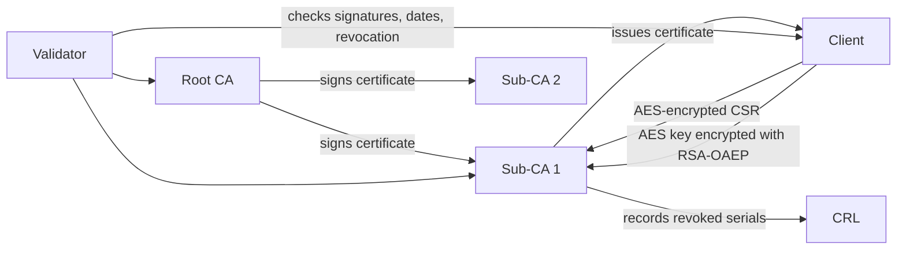

# Python PKI Certificate System

## Overview

This project implements a simplified Public Key Infrastructure system in Python. It simulates a Root CA, Sub-CAs and clients that request, receive, validate and revoke certificates.

The project is educational and is not intended for production security use.

## Problem Statement

Certificate-based trust requires key generation, certificate signing, certificate-chain validation and revocation handling. This project demonstrates those concepts in a local workflow using generated keys, generated X.509 certificates and hybrid-encrypted certificate signing requests.

## Features

- Root CA RSA key pair and self-signed certificate generation
- Sub-CA key pairs and Root-CA-signed certificates
- Client key pairs and certificate signing requests
- Hybrid CSR protection using AES-256-CBC and RSA-OAEP
- Client certificate issuance by selected Sub-CAs
- Client -> Sub-CA -> Root CA certificate-chain validation
- Text-file CRL simulation for revoked client certificates
- Argument-driven CLI scripts and pytest coverage

## Architecture



## Technologies Used

- Python
- cryptography
- RSA
- AES-256-CBC
- RSA-OAEP
- X.509
- CSRs
- CRLs
- pytest

## How To Run

```bash
python -m venv .venv
source .venv/bin/activate
python -m pip install --upgrade pip
pip install -e ".[dev]"
```

Generate the Root CA:

```bash
python -m pki_certificate_system.root_ca
```

Generate two Sub-CAs:

```bash
python -m pki_certificate_system.sub_ca sub_ca_1
python -m pki_certificate_system.sub_ca sub_ca_2
```

Create client key pairs and hybrid-encrypted CSRs:

```bash
python -m pki_certificate_system.client client_1 sub_ca_1
python -m pki_certificate_system.client client_2 sub_ca_1
python -m pki_certificate_system.client client_3 sub_ca_2
```

Issue client certificates:

```bash
python -m pki_certificate_system.issue_cert client_1 sub_ca_1
python -m pki_certificate_system.issue_cert client_2 sub_ca_1
python -m pki_certificate_system.issue_cert client_3 sub_ca_2
```

Validate the default demo chains:

```bash
python -m pki_certificate_system.validate_demo
```

Revoke a client certificate and validate again:

```bash
python -m pki_certificate_system.revoke_demo client_1 sub_ca_1
python -m pki_certificate_system.validate_demo --client-id client_1 --sub-ca-name sub_ca_1
```

Remove generated keys, certificates, encrypted CSRs and CRLs:

```bash
python -m pki_certificate_system.clean_store
```

Run tests:

```bash
pytest
```

## Folder Structure

```text
pki-certificate-system-python/
  README.md
  academic-integrity.md
  requirements.txt
  .gitignore
  cert_store/
    .gitkeep
  src/
    pki_certificate_system/
      root_ca.py
      sub_ca.py
      client.py
      issue_cert.py
      cert_utils.py
      revocation.py
      revoke_demo.py
      validate_demo.py
      clean_store.py
  tests/
    test_pki_workflow.py
```

## Notes

- Generated private keys and certificates are written under `cert_store/` and ignored by Git.
- This is a local educational simulator, not a production CA or secure certificate-management service.
- See `academic-integrity.md` for the portfolio reconstruction note.
